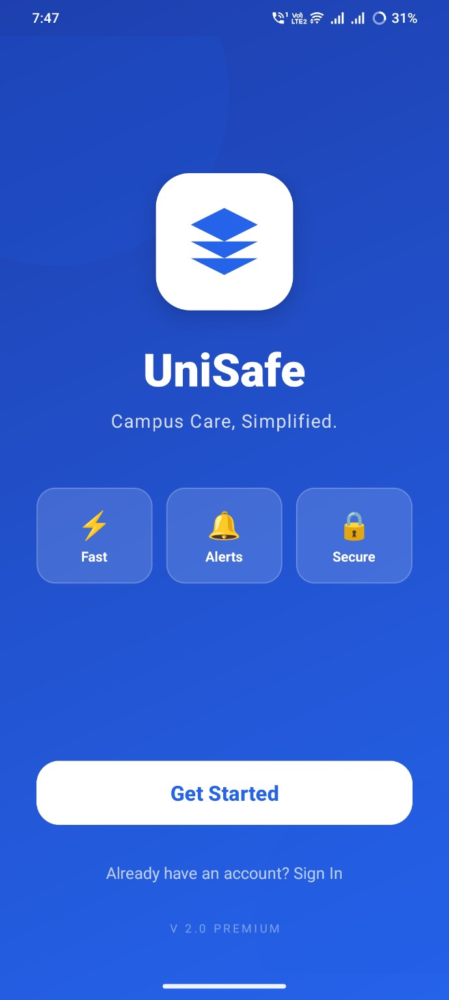
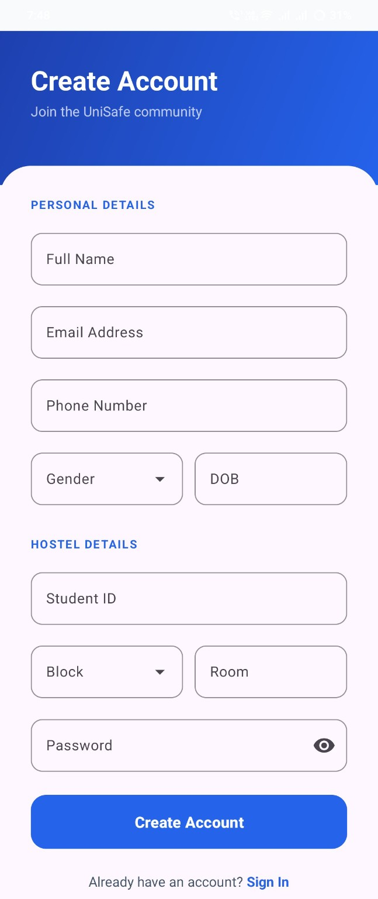
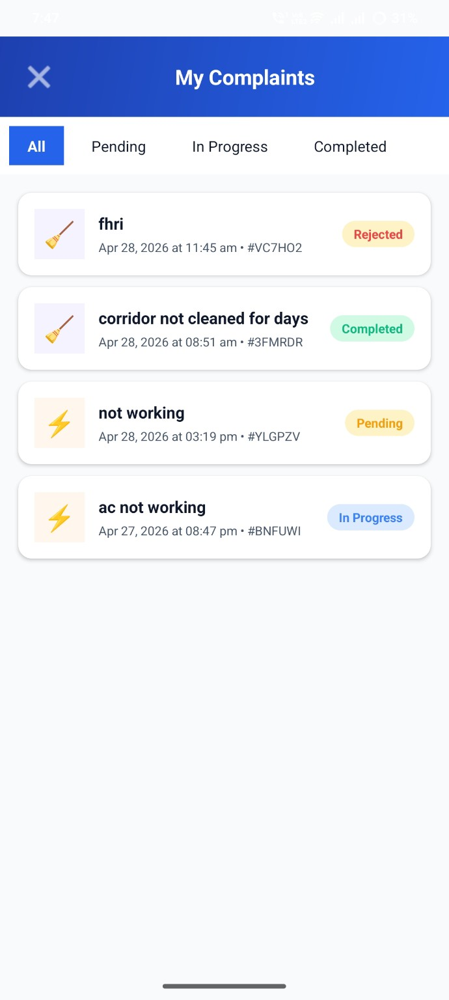
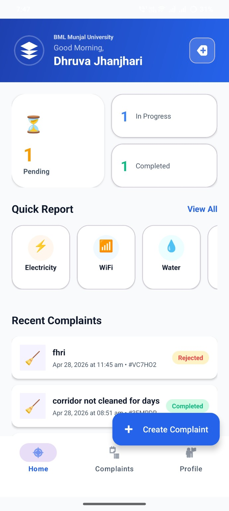

# 📱 UniSafe – Campus Care Simplified

UniSafe is an Android-based campus complaint management system that allows students to report hostel/campus issues and enables admins to manage and resolve them efficiently using Firebase.

---

## 🚀 Features

### 👨‍🎓 Student Portal

* 🔐 Secure Login & Signup
* 📝 Easy complaint creation
* 📂 Multiple complaint categories
* 📊 Real-time status tracking
* 📜 Complaint history
* 👤 Profile management

---

### 🛠️ Admin Interface (Dhruva Jhanjhari Panel)

* 📊 Dashboard with complaint statistics
* 📋 View and manage all complaints
* ✅ Update complaint status
* ⚡ Quick actions for faster resolution

---

## 📂 Complaint Categories

* ⚡ Electricity
* 📶 WiFi & Internet
* 💧 Water Supply
* 🧹 Cleaning & Hygiene
* 🔧 Maintenance
* 🔒 Security
* 📋 Others

---

## 📊 Complaint Status Flow

* 🟡 Pending
* 🔵 In Progress
* 🟢 Completed
* 🔴 Rejected

---

## 🖼️ Screenshots


<p align="center">
  
  
  
</p>

<p align="center">
  
</p>

---

## 🛠️ Tech Stack

* 📱 Android (Java / XML)
* 🔥 Firebase Authentication
* 🔥 Firebase Realtime Database / Firestore
* 🎨 Material UI Components

---

## ⚙️ Installation & Setup

1. Clone the repository:

```bash
git clone [(https://github.com/lakshay125/Unisafe.git)]
```

2. Open in Android Studio

3. Add Firebase:

* Download `google-services.json`
* Place it in `/app` folder
* Enable Authentication & Database

4. Build and Run the project

---

## 🔄 Workflow

1. User signs up / logs in
2. Student submits complaint
3. Data stored in Firebase
4. Admin reviews and updates status
5. Student tracks updates

---

## 🚀 Future Improvements

* 🔔 Push Notifications
* 📷 Image upload with complaints
* 📍 Location-based complaints
* 📊 Advanced analytics

---

## 📌 Conclusion

UniSafe improves campus life by:

* Streamlining complaint handling
* Increasing transparency
* Reducing manual workload

---

## 👨‍💻 Author

Lakshay
Developed as an Android project using Firebase.
